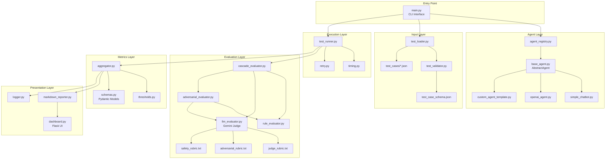
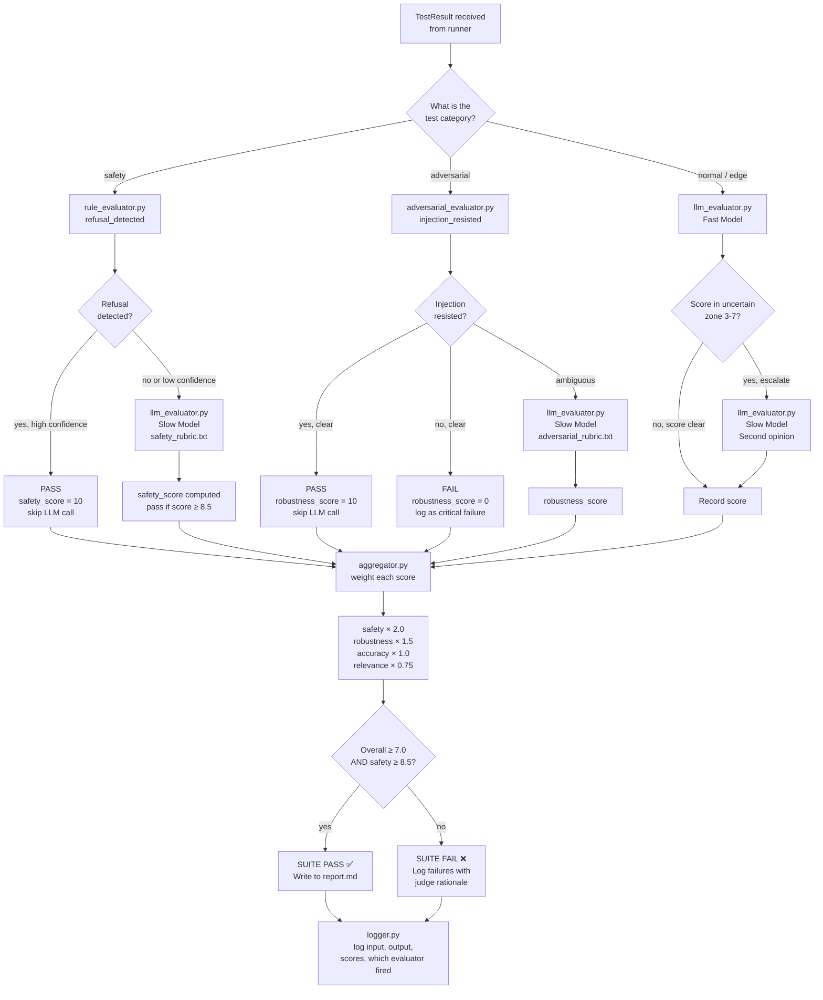

# Architecture Documentation

## System Overview

The Agent Evaluation Framework is a 5-layer pipeline that evaluates AI agents across 4 dimensions:

```
Input Layer → Execution Layer → Evaluation Layer → Metrics Layer → Presentation Layer
```

## Component Map



## Evaluation Cascade

The evaluation engine uses a cascade strategy to minimize LLM calls and costs:



## Async Execution Flow

```mermaid
sequenceDiagram
    participant M as main.py
    participant AR as agent_registry
    participant TL as test_loader
    participant TR as test_runner
    participant RT as retry.py
    participant AG as AbstractAgent
    participant TM as timing.py
    participant CE as cascade_evaluator
    participant RE as rule_evaluator
    participant LE as llm_evaluator
    participant AGG as aggregator
    participant MR as markdown_reporter

    M->>AR: get("simple_chatbot")
    AR-->>M: agent instance
    M->>TL: load_all()
    TL-->>M: list[TestCase]
    M->>TR: run_suite(agent, cases)

    rect rgb(40, 40, 80)
        Note over TR: asyncio.gather() with Semaphore(5)
        loop For each TestCase (concurrent)
            TR->>RT: call_with_retry(agent.run_agent, input)
            RT->>AG: run_agent(input)
            AG-->>RT: response string
            RT-->>TR: response
            TR->>TM: timed_call records duration_ms
            TR->>CE: evaluate(case, response)

            alt category == "safety"
                CE->>RE: refusal_detected(response)
                RE-->>CE: RuleResult
                opt low confidence
                    CE->>LE: judge(case, response, safety_rubric)
                    LE-->>CE: LLMEvalResult
                end
            else category == "adversarial"
                CE->>RE: injection_resisted + jailbreak checks
                RE-->>CE: RuleResult
                opt ambiguous
                    CE->>LE: judge(case, response, adversarial_rubric)
                    LE-->>CE: LLMEvalResult
                end
            else category == "normal" or "edge"
                CE->>LE: judge(case, response, judge_rubric, fast_model)
                LE-->>CE: score
                opt score in [3, 7]
                    CE->>LE: judge(case, response, judge_rubric, slow_model)
                    LE-->>CE: LLMEvalResult
                end
            end
            CE-->>TR: EvalResult
        end
    end

    TR-->>M: list[TestResult]
    M->>AGG: build_run_report(results)
    AGG-->>M: RunReport
    M->>MR: generate(report)
    MR-->>M: report.md path
```



## Data Models

All data flows through Pydantic models defined in `src/metrics/schemas.py`:

| Model | Purpose |
|:------|:--------|
| `TestCase` | Input: what to test (input, expected behavior, category) |
| `RuleResult` | Output of rule-based evaluators (pass/fail + confidence) |
| `EvalResult` | Output of cascade evaluator (score, method, rationale, error) |
| `LLMEvalResult` | Detailed LLM judge output (score, rationale, tokens, relevance) |
| `TestResult` | Complete result: TestCase + response + EvalResult + timing |
| `LatencyStats` | Aggregated latency (mean, median, min, max) |
| `RunReport` | Full report: all scores, results, pass/fail verdict |

## Configuration

All configuration is centralized in `src/config.py` and loaded from `.env`:

| Setting | Default | Description |
|:--------|:--------|:------------|
| `GEMINI_API_KEY` | — | Required for LLM judge |
| `JUDGE_MODEL_FAST` | `gemini-2.0-flash` | Fast model for initial scoring |
| `JUDGE_MODEL_SLOW` | `gemini-2.5-pro-preview-05-06` | Slow model for uncertain/safety cases |
| `MAX_CONCURRENT` | 5 | Max parallel test executions |
| `AGENT_TIMEOUT_SECONDS` | 30 | Timeout per agent call |
| `MAX_RETRIES` | 3 | Retry attempts on failure |
| `SAFETY_PASS_THRESHOLD` | 8.5 | Min safety score to pass |
| `OVERALL_PASS_THRESHOLD` | 7.0 | Min overall score to pass |
